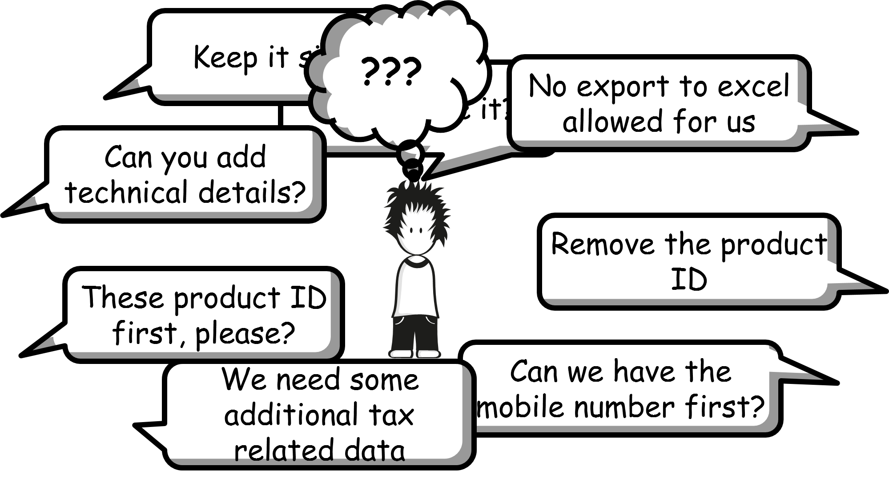

# Extensibility, Adaptation and more – Patterns for truly flexible Standard Software

Don’t repeat yourself aka DRY principle is one the most prominent in the software space. If you are building a software product you want to ship it to all your customers. But often getting the last 10-20% fit is hard. That is where the conflicting requirements are. Especially when you look at it from the UI.

During the past 10+ years at SAP I have seen many solutions to the problem in various technological scenarios (such as SAP CRM, SAP By Design, SAP Web IDE or SAPUI5 Flexibility Services) and languages (e.g. ABAP, Java or JavaScript). I experienced that, despite the underlying technology, all those extensibility projects had certain challenges in common. I collected those recurring problems and what I've learned from decisions that were made, the good ones and the bad ones. The result is a pattern language that I presented in my talk at OOP 2018:

The “Identity” pattern addresses the problem that an extension may become an own object with an own identity that replaces an original artifact completely or coexists with the original object replacing it (maybe not even every time and only in certain contexts).
To support the “Identity” pattern one has the need to guarantee that the id of an extension object is unique and that no id clashes can occur. This issue is addressed with the “Namespacing” pattern.
One elegant way to address the problem is to provide extensions as “Delta Objects” that extend a given object without changing its identity. A runtime or build environment is bringing the delta and the original object together.
To assure lifecycle stability these “Delta Objects” need a stable place where they can hook in. This aspect is addressed with the “Anchorpoint” pattern.
Especially where multiple “Delta Objects” are added at the same “Anchorpoint” there may occur situations where the order of execution or appliance of an extension matters and needs to follow certain rules. In this context, the “Priority” pattern provides some insights how to do that.
In cases where the extension object should completely replace the original object, that might only serve as template, the “Copy” pattern can be applied.
A very simple way to provide extensibility with a minimum of framework environment needed and programming model enforced is to deliver predefined extensions that can be activate and individualized by customers. What should be considered in this situation is described in the Predefined Extension pattern.
If you are interested in more on these patterns, please leave a comment and I might provide some more details.

If you want to know more, reach out to me on twitter [@S7nW7s](https://twitter.com/s7nw7s). The slides from my conference talk are also available here: [Extensibility, Adaptation and more – Patterns for truly flexible Standard Software.pdf](Extensibility%20Adaptation%20and%20more%20-%20Patterns%20for%20truly%20flexible%20Standard%20Software.pdf)
